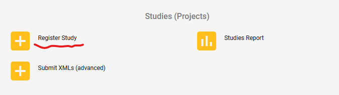
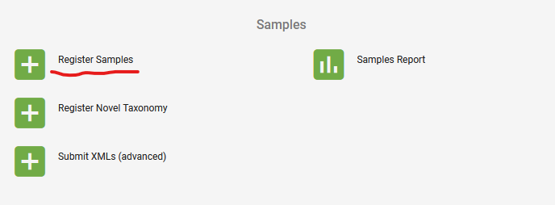
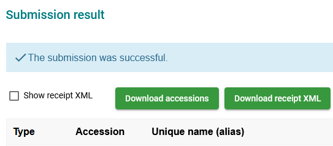

# ENA\_tools
Scripts for submitting sequence data to the ENA database

[ENA's general guide on data submission](https://ena-docs.readthedocs.io/en/latest/submit/general-guide.html)

<br/>

## 1.  Register a study

The easiest way to register a study (BioProject) with the ENA database is using the interactive webpage on the [Webin Submissions Portal](https://www.ebi.ac.uk/ena/submit/webin/).



Output: a BioProject accession.

<br/>

## 2. Register samples

The easiest way to register samples with the ENA database is using the interactive approach provided by the Webin Submission Portal.

### Interactive submission

- Click the link "Register Samples":



- Download spreadsheet to register samples > Pathogen Checklists > ENA prokaryotic pathogen minimal sample checklist (note the permitted values in drop-down lists) > Selected recommended and optional fields in addition to mandatory fields > Next > Download TSV Template
- Upload filled spreadsheet (TSV format) to register samples



- Download the accessions if the submission is successful.

### XML approach

Use script `sampleTSV2XML.py` to create the XML file to be uploaded to the Webin Submissions Portal via page "Submit XMLs (advanced)".

Example command:

```bash
python sampleTSV2XML.py -i Ecoli_metadata.tsv -a attr.txt -t 'Imperial College London' > Ecoli_metadata.xml
```

- `-i`: a tab-delimited file (TSV) consisting of all data fields, including mandatory fields required by the ENA
- `-a`: a list of the names of optional fields in the input TSV file to be included in the output XML file
- `-t`: name of the sequencing centre or submitter's institute

<br/>

## 3. Registering sequencing experiments

Reference: [ENA's guidance](https://ena-docs.readthedocs.io/en/latest/submit/general-guide.html)

### Paired-end Illumina reads

Experiments are linked to the study by the BioProject accession.

Example command:

```bash
python experimentTSV2XML.py Ecoli_experiment.tsv > Ecoli_experiment.xml
```

<br/>

## 4. Programmatic submission of sequencing reads

